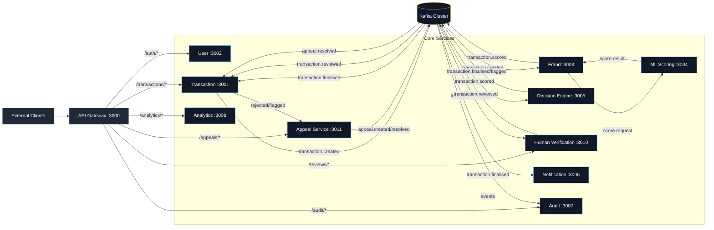
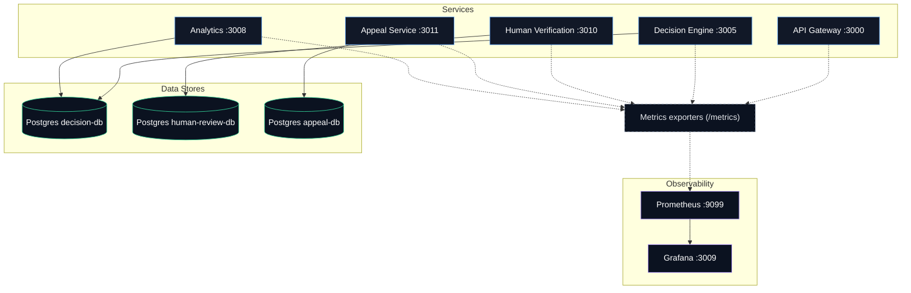

# Fraud Detection Platform

Real-time payment fraud detection platform built with Node.js microservices, Kafka, PostgreSQL, and Redis.

---

## Project Metadata

- Team / Author: `ESD G05 T05`
- License: `SMU`
- Centralized REST API documentation: `http://localhost:3000/api-docs`

---
## System Architecture

### 1) Request + Event Flow (Context Diagram)


### 2) Data Stores + Observability (Deployment/Data Diagram)


## Current Services

| Service | Port | Status |
|---|---|---|
| API Gateway | 3000 | Live |
| Transaction Service | 3001 | Live |
| User Service | 3002 | Live |
| Fraud Detection Service | 3003 | Live |
| ML Scoring Service | 3004 | Live |
| Decision Engine | 3005 | Live |
| Human Verification Service | 3010 | Live |
| Appeal Service | 3011 | Live |
| Notification Service | 3006 | Live |
| Audit Service | 3007 | Live |
| Analytics Service | 3008 | Live |
| Monitoring Service (Prometheus/Grafana) | 9099 / 3009 | Live |

---

## Prerequisites

- Docker Desktop
- Docker Compose

---

## Quick Start

```bash
# Start all services
docker compose up --build

# Start in background
docker compose up --build -d
```

Main entrypoints:

- API Gateway: `http://localhost:3000`
- Analytics Dashboard UI: `http://localhost:3008`
- Grafana Dashboard: `http://localhost:3009`
- Prometheus UI: `http://localhost:9099`
- Jaeger UI (Tracing): `http://localhost:16686`

Azure HTTPS entrypoint:

- Set `PUBLIC_HOST` to your VM DNS name, for example `esd-g06-t05.eastasia.cloudapp.azure.com`
- Start the proxy profile: `docker compose --profile azure-proxy up -d human-verification-proxy`
- Open these URLs:
  - Human Verification: `https://<your-host>/human-verification/`
  - Analytics Dashboard: `https://<your-host>/analytics/`
  - API Gateway Docs: `https://<your-host>/api-docs`

This terminates TLS on `80/443` and routes requests as follows:
- `/` -> redirects to `/human-verification/`
- `/human-service` -> redirects to `/human-verification/`
- `/human-verification/*` -> `human-verification-service:3010`
- `/api/v1/reviews*` -> `human-verification-service:3010`
- `/api/v1/analytics*` -> `analytics-service:3008`
- `/analytics/*` and `/analytics/ws` -> `analytics-service:3008`
- `/api/*` and `/api-docs*` -> `api-gateway:3000`

---

## Project Structure

```text
fraud-detection-system/
|-- .gitignore
|-- README.md
|-- docker-compose.yml
|
|-- api-gateway/
|   |-- src/
|   |   |-- config/           # App config, logger, Redis client
|   |   |-- middleware/       # JWT auth, rate limiter, error handler, circuit breaker
|   |   |-- routes/           # Health, auth proxy, service proxy
|   |   |-- utils/            # Errors, metrics, constants
|   |   `-- index.js
|   |-- .dockerignore
|   |-- Dockerfile
|   `-- package.json
|
|-- user-service/
|   |-- src/
|   |   |-- config/           # App config, logger, Redis client
|   |   |-- controllers/      # User HTTP handlers
|   |   |-- db/               # PostgreSQL pool, migrations
|   |   |-- middleware/       # Auth, validation, request context, error handler
|   |   |-- repositories/     # User DB operations
|   |   |-- routes/           # User routes, health endpoints
|   |   |-- services/         # Auth logic (bcrypt, JWT generation)
|   |   |-- utils/            # Errors, constants (roles, status)
|   |   `-- index.js
|   |-- .dockerignore
|   |-- Dockerfile
|   `-- package.json
|
|-- transaction-service/
|   |-- src/
|   |   |-- config/           # App config, logger
|   |   |-- controllers/      # Transaction HTTP handlers
|   |   |-- db/               # PostgreSQL pool, migrations
|   |   |-- kafka/            # Producer, outbox publisher, decision consumer
|   |   |-- middleware/       # Request context, validation, error handler
|   |   |-- repositories/     # Transaction DB operations
|   |   |-- routes/           # Transaction routes, health endpoints
|   |   |-- services/         # Transaction business logic
|   |   |-- utils/            # Errors, constants, metrics
|   |   `-- index.js
|   |-- .dockerignore
|   |-- Dockerfile
|   `-- package.json
|
|-- fraud-detection-service/
|   |-- src/
|   |   |-- config/           # App config, logger, Redis client, Kafka
|   |   |-- consumers/        # Kafka transaction consumer
|   |   |-- metrics/          # Prometheus metrics
|   |   |-- middleware/       # Correlation ID, request logger
|   |   |-- routes/           # Health endpoints, metrics scrape
|   |   |-- rules/            # Rule-based fraud engine
|   |   |-- services/         # Fraud orchestration, ML scoring client, circuit breaker
|   |   `-- index.js
|   |-- .dockerignore
|   |-- Dockerfile
|   `-- package.json
|
|-- ml-scoring-service/
|   |-- src/
|   |   |-- config/           # App config, logger, Redis client
|   |   |-- controllers/      # Scoring HTTP handlers
|   |   |-- middleware/       # Validation, timeout, request logging
|   |   |-- models/           # Fraud model
|   |   |-- routes/           # Health, metrics, scoring endpoints
|   |   |-- services/         # Feature engineering + ML scoring
|   |   `-- utils/            # Errors, metrics
|   |-- .dockerignore
|   |-- Dockerfile
|   `-- package.json
|
|-- decision-engine-service/
|   |-- src/
|   |   |-- config/           # App config, Kafka config, logger
|   |   |-- consumers/        # Kafka transaction consumer
|   |   |-- controllers/      # Decision HTTP handlers
|   |   |-- db/               # PostgreSQL pool, migrations
|   |   |-- repositories/     # Decision DB operations
|   |   |-- routes/           # Decision routes, health, metrics endpoints
|   |   |-- services/         # Decision engine logic
|   |   `-- utils/            # Metrics
|   |-- .dockerignore
|   |-- Dockerfile
|   `-- package.json
|
|-- notification-service/
|   |-- src/
|   |   |-- config/           # App config, logger, Kafka
|   |   |-- consumers/        # Decision event consumer
|   |   |-- routes/           # Health, metrics endpoints
|   |   |-- services/         # Notification orchestration, email, sms
|   |   |-- templates/        # HTML/text email templates
|   |   `-- index.js
|   |-- .dockerignore
|   |-- Dockerfile
|   `-- package.json
|
|-- analytics-service/
|   |-- src/
|   |   |-- config/           # App config, logger, DB/Redis/Kafka clients
|   |   |-- public/           # Dashboard UI (index.html, JS, CSS)
|   |   |-- routes/           # Health + analytics API endpoints
|   |   |-- services/         # Aggregation and real-time websocket broadcast
|   |   `-- index.js
|   |-- .dockerignore
|   |-- Dockerfile
|   `-- package.json
|
|-- audit-service/
|   |-- src/
|   |   |-- config/           # App config, logger, Kafka, metrics
|   |   |-- db/               # PostgreSQL pool, migrations
|   |   |-- consumers/        # Kafka event consumers for audit trails
|   |   |-- routes/           # Health, metrics, and audit query APIs
|   |   `-- index.js
|   |-- .dockerignore
|   |-- Dockerfile
|   `-- package.json
|
|-- appeal-service/
|   |-- src/
|   |   |-- config/           # App config, logger, Kafka
|   |   |-- db/               # PostgreSQL pool, migrations
|   |   |-- repositories/     # Appeal DB operations
|   |   |-- services/         # Appeal business logic + event publishing
|   |   |-- controllers/      # Appeal HTTP handlers
|   |   |-- routes/           # Appeal routes + health
|   |   `-- index.js
|   |-- .dockerignore
|   |-- Dockerfile
|   `-- package.json
|
`-- monitoring/
    |-- prometheus.yml        # Prometheus scrape configuration
    `-- grafana/              # Grafana provisioning + dashboards
```

---

## Health Checks

No authentication required.

- `GET /api/v1/health/live`
- `GET /api/v1/health`

Examples:

- Gateway: `http://localhost:3000/api/v1/health`
- Analytics: `http://localhost:3008/api/v1/health`
- Audit: `http://localhost:3007/api/v1/health`
- Prometheus: `http://localhost:9099/-/healthy`
- Grafana: `http://localhost:3009/api/health`

---

## Testing

Use Postman collection: `testing/test.json`.

1. Start services with Docker Compose.
2. Import `testing/test.json` in Postman.
3. Run folders in order from `01` to `09`.
4. Visit analytics dashboard UI at `http://localhost:3008` and Grafana at `http://localhost:3009` during/after tests.

Detailed guide: `testing/TESTING.md`.

---

## Offline ML Evaluation

Generate a reproducible evaluation report (precision, recall, F1, ROC-AUC, confusion matrix, threshold tradeoffs, and approve/flag/decline impact):

```bash
cd ml-scoring-service
npm run evaluate:model
```

Artifacts are written to:

- `ml-scoring-service/data/models/latest/evaluation.json`
- `ml-scoring-service/data/models/latest/evaluation.md`

---

## Infrastructure

| Container | Image | Purpose |
|---|---|---|
| zookeeper | confluentinc/cp-zookeeper:7.5.0 | Kafka coordination |
| kafka | confluentinc/cp-kafka:7.5.0 | Event streaming |
| kafka-init | confluentinc/cp-kafka:7.5.0 | Topic creation on startup |
| redis | redis:7-alpine | Caching/rate-limiting/velocity |
| user-db | postgres:15-alpine | User storage |
| transaction-db | postgres:15-alpine | Transaction storage |
| decision-db | postgres:15-alpine | Decision storage |
| appeal-db | postgres:15-alpine | Appeal storage |
| audit-db | postgres:15-alpine | Audit storage |
| prometheus | prom/prometheus:v2.51.0 | Metrics scraping and storage |
| grafana | grafana/grafana:10.4.2 | Metrics dashboards and visualization |
| otel-collector | otel/opentelemetry-collector-contrib:0.121.0 | Collects OTLP traces from services |
| jaeger | jaegertracing/all-in-one:1.57 | Distributed tracing storage and UI |

### Distributed Tracing

This stack uses OpenTelemetry tracing from each microservice to `otel-collector`, then exports to Jaeger.

- OTEL Collector endpoint (HTTP): `http://otel-collector:4318`
- Jaeger UI: `http://localhost:16686`
- Sampling strategy: `parentbased_traceidratio` with ratio `1.0`

To validate traces:

1. Start platform: `docker compose up --build -d`
2. Send requests through API Gateway (`/api/v1/...`)
3. Open Jaeger UI and search for services (for example `api-gateway`, `transaction-service`, `fraud-detection-service`)

### Monitoring Jaeger

Jaeger and the OpenTelemetry Collector are now included in the Prometheus scrape config and Grafana provisioning:

- Prometheus targets:
  - `otel-collector:8888` (collector metrics)
  - `jaeger:14269` (Jaeger admin/metrics)
- Grafana datasource:
  - `Jaeger` (for trace exploration from Grafana)
- Grafana dashboard:
  - `Tracing Operations` (collector throughput, dropped spans, Jaeger request/error signals)

### Kafka Topics

- `transaction.created`
- `transaction.scored`
- `transaction.finalised`
- `transaction.flagged`
- `transaction.reviewed`
- `appeal.created`
- `appeal.resolved`
- `transaction.reversed`
- `transaction.dlq`
- `transaction.decision.dlq`
- `notification.dlq`
- `appeal.dlq`

---

## Stop / Reset

```bash
# Stop containers
docker compose down

# Stop + remove volumes
docker compose down -v
```
