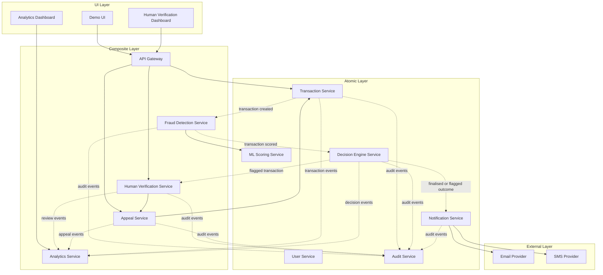

# Fraud Detection Platform

Fraud Detection Platform is a microservices-based payment fraud detection system built for the SMU ESD project. It uses Node.js services, Kafka for event flow, PostgreSQL for service data, Redis for caching and analytics projection, and Docker Compose for local deployment.

## Team

- Team: `ESD G05 T05`
- API documentation: `http://localhost:3000/api-docs`

## Services

| Service                    | Port | Purpose                                                        |
| -------------------------- | ---- | -------------------------------------------------------------- |
| API Gateway                | 3000 | Single entry point for client requests and aggregated API docs |
| Transaction Service        | 3001 | Creates and updates transactions                               |
| User Service               | 3002 | Authentication, profile, and user data                         |
| Fraud Detection Service    | 3003 | Rule-based fraud checks and ML scoring request flow            |
| ML Scoring Service         | 3004 | Fraud risk scoring                                             |
| Decision Engine Service    | 3005 | Final approve, flag, or decline decision                       |
| Notification Service       | 3006 | Email and SMS notifications                                    |
| Audit Service              | 3007 | Audit trail storage                                            |
| Analytics Service          | 3008 | Dashboard and real-time analytics                              |
| Human Verification Service | 3010 | Manual review for flagged transactions and appeals             |
| Appeal Service             | 3011 | Appeal submission and resolution                               |

## Layered Architecture



`-->` shows synchronous service calls. `-.->` shows event-driven service interactions without drawing Kafka itself.

## Quick Start

1. Copy `.env.example` to `.env`.
2. Update secrets or provider settings if needed.
3. Start the full stack:

```bash
docker compose up --build -d
```

Useful URLs:

- Gateway: `http://localhost:3000`
- API docs: `http://localhost:3000/api-docs`
- Analytics dashboard: `http://localhost:3008`
- Human verification dashboard (direct): `http://localhost:3010`
- Human verification dashboard (via gateway): `http://localhost:3000/human-verification`
- Grafana: `http://localhost:3009`
- Prometheus: `http://localhost:9099`
- Jaeger: `http://localhost:16686`

To stop the stack:

```bash
docker compose down
```

To remove volumes as well:

```bash
docker compose down -v
```

## Testing

Postman collection:

- `testing/test.json`

Node-based scripts:

```bash
cd testing
npm run smoke:health
npm run test:guards
npm run e2e:happy-path
npm run proof:notification
```

Detailed test instructions are in `testing/TESTING.md`.

## Demo

The demo UI is in `demo/` and connects to the live API Gateway. Run it with a simple static server:

```bash
cd demo
python -m http.server 8080
```

Open `http://localhost:8080`.

See `demo/README.md` for the demo flow and runtime configuration.

## Notification Providers

The notification service supports:

- `mock` mode for local demo use
- `smtp` for real email delivery
- `twilio` for real SMS delivery

Provider settings are configured in the project root `.env`. See `notification-service/README.md` for the required variables and verification steps.

## Additional Notes

- Health endpoints are exposed under `/api/v1/health` for the main services.
- Internal service ports are bound to `127.0.0.1` by default through Docker Compose.
- The Human Verification and Notification services each expose their own Swagger docs at `/api-docs`.
