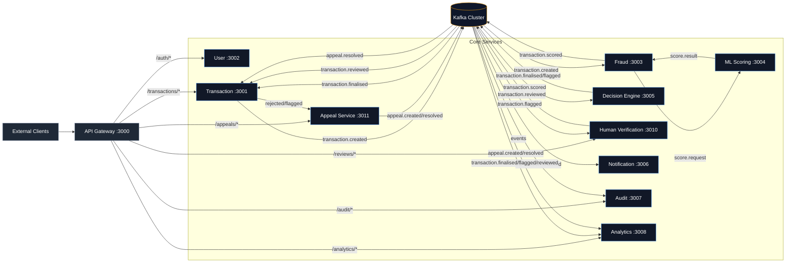
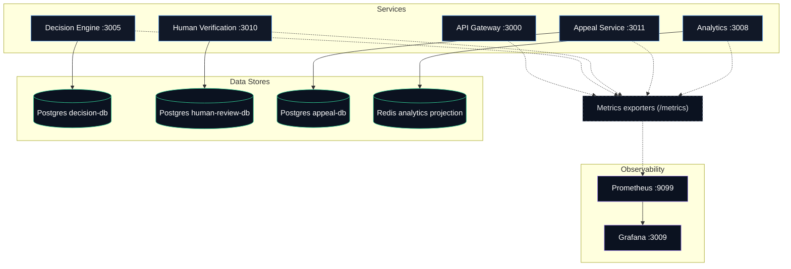

# Fraud Detection Platform

Real-time payment fraud detection platform built with Node.js microservices, Kafka, PostgreSQL, and Redis.

---

## Project Metadata

- Team / Author: `ESD G05 T05`
- License: `SMU`
- Centralized REST API documentation: `http://localhost:3000/api-docs`

---
## System Architecture

### 1) Request + Event Flow (Context Diagram)


### 2) Data Stores + Observability (Deployment/Data Diagram)


## Current Services

| Service | Port | Status |
|---|---|---|
| API Gateway | 3000 | Live |
| Transaction Service | 3001 | Live |
| User Service | 3002 | Live |
| Fraud Detection Service | 3003 | Live |
| ML Scoring Service | 3004 | Live |
| Decision Engine | 3005 | Live |
| Human Verification Service | 3010 | Live |
| Appeal Service | 3011 | Live |
| Notification Service | 3006 | Live |
| Audit Service | 3007 | Live |
| Analytics Service | 3008 | Live |
| Monitoring Service (Prometheus/Grafana) | 9099 / 3009 | Live |

---

## Prerequisites

- Docker Desktop
- Docker Compose

---

## Quick Start

```bash
# Review env-backed defaults
# .env.example documents all required values

# Start all services
docker compose up --build

# Start in background
docker compose up --build -d
```

Main entrypoints:

- API Gateway: `http://localhost:3000`
- Analytics Dashboard UI: `http://localhost:3008`
- Grafana Dashboard: `http://localhost:3009`
- Prometheus UI: `http://localhost:9099`
- Jaeger UI (Tracing): `http://localhost:16686`

Notes:

- Docker Compose now reads secrets and host port bindings from `.env`
- Internal service ports are bound to `127.0.0.1` by default to reduce accidental public exposure
- Public-facing entrypoints remain the gateway and selected dashboards unless you override bind hosts in `.env`
- Analytics now builds its dashboard from its own Redis projection fed by Kafka events instead of reading other services' databases

---


## Health Checks

No authentication required.

- `GET /api/v1/health/live`
- `GET /api/v1/health`

Examples:

- Gateway: `http://localhost:3000/api/v1/health`
- Analytics: `http://localhost:3008/api/v1/health`
- Audit: `http://localhost:3007/api/v1/health`
- Prometheus: `http://localhost:9099/-/healthy`
- Grafana: `http://localhost:3009/api/health`

---

## Testing

Use Postman collection: `testing/test.json`.

1. Start services with Docker Compose.
2. Import `testing/test.json` in Postman.
3. Run folders in order from `01` to `09`.
4. Visit analytics dashboard UI at `http://localhost:3008` and Grafana at `http://localhost:3009` during/after tests.

Automated Node-based test paths:

```bash
cd testing
npm run smoke:health
npm run test:guards
npm run e2e:happy-path
npm run proof:notification
```

- `smoke:health` checks gateway and observability endpoints are reachable.
- `test:guards` validates auth and validation failure paths.
- `e2e:happy-path` runs the main end-to-end business flow.
- `proof:notification` reports whether notification delivery is still using mocks or a real SMTP/Twilio provider.

CI coverage:

- GitHub Actions boots the full Docker Compose stack and runs the smoke, guard, and happy-path suites on pushes and pull requests.

Detailed guide: `testing/TESTING.md`.

### Proving The External Service Requirement

The notification service supports both mock mode for local runs and real SMTP/Twilio providers for grading.

1. Set provider variables in `.env`:
   - `EMAIL_PROVIDER=smtp` with the `EMAIL_SMTP_*` variables
   - or `SMS_PROVIDER=twilio` with the `TWILIO_*` variables
2. Restart the stack: `docker compose up --build -d`
3. Run `cd testing && npm run proof:notification`
4. To fail unless a real external provider is active, set the `REQUIRE_REAL_NOTIFICATION_PROVIDER` environment variable to `true`

`http://localhost:3006/api/v1/health` now reports provider mode, sender configuration, fallback recipients, and whether a real external provider is enabled.

---

## Offline ML Evaluation

Generate a reproducible evaluation report (precision, recall, F1, ROC-AUC, confusion matrix, threshold tradeoffs, and approve/flag/decline impact):

```bash
cd ml-scoring-service
npm run evaluate:model
```

Artifacts are written to:

- `ml-scoring-service/data/models/latest/evaluation.json`
- `ml-scoring-service/data/models/latest/evaluation.md`

---

## Infrastructure

| Container | Image | Purpose |
|---|---|---|
| zookeeper | confluentinc/cp-zookeeper:7.5.0 | Kafka coordination |
| kafka | confluentinc/cp-kafka:7.5.0 | Event streaming |
| kafka-init | confluentinc/cp-kafka:7.5.0 | Topic creation on startup |
| redis | redis:7-alpine | Caching/rate-limiting/velocity |
| user-db | postgres:15-alpine | User storage |
| transaction-db | postgres:15-alpine | Transaction storage |
| decision-db | postgres:15-alpine | Decision storage |
| appeal-db | postgres:15-alpine | Appeal storage |
| audit-db | postgres:15-alpine | Audit storage |
| prometheus | prom/prometheus:v2.51.0 | Metrics scraping and storage |
| grafana | grafana/grafana:10.4.2 | Metrics dashboards and visualization |
| otel-collector | otel/opentelemetry-collector-contrib:0.121.0 | Collects OTLP traces from services |
| jaeger | jaegertracing/all-in-one:1.57 | Distributed tracing storage and UI |

### Distributed Tracing

This stack uses OpenTelemetry tracing from each microservice to `otel-collector`, then exports to Jaeger.

- OTEL Collector endpoint (HTTP): `http://otel-collector:4318`
- Jaeger UI: `http://localhost:16686`
- Sampling strategy: `parentbased_traceidratio` with ratio `1.0`

To validate traces:

1. Start platform: `docker compose up --build -d`
2. Send requests through API Gateway (`/api/v1/...`)
3. Open Jaeger UI and search for services (for example `api-gateway`, `transaction-service`, `fraud-detection-service`)

### Monitoring Jaeger

Jaeger and the OpenTelemetry Collector are now included in the Prometheus scrape config and Grafana provisioning:

- Prometheus targets:
  - `otel-collector:8888` (collector metrics)
  - `jaeger:14269` (Jaeger admin/metrics)
- Grafana datasource:
  - `Jaeger` (for trace exploration from Grafana)
- Grafana dashboard:
  - `Tracing Operations` (collector throughput, dropped spans, Jaeger request/error signals)

### Kafka Topics

- `transaction.created`
- `transaction.scored`
- `transaction.finalised`
- `transaction.flagged`
- `transaction.reviewed`
- `appeal.created`
- `appeal.resolved`
- `transaction.reversed`
- `transaction.dlq`
- `transaction.decision.dlq`
- `notification.dlq`
- `appeal.dlq`

---

## Stop / Reset

```bash
# Stop containers
docker compose down

# Stop + remove volumes
docker compose down -v
```
