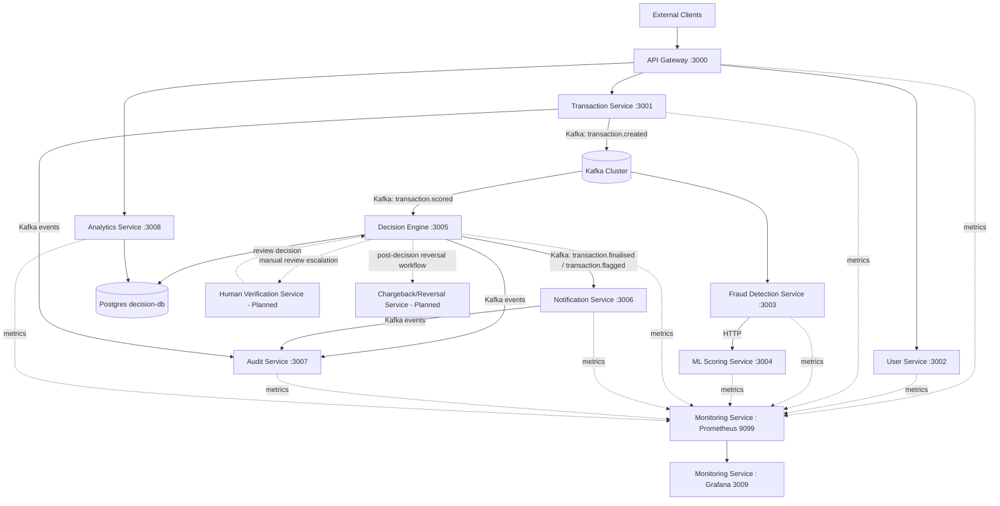

# Fraud Detection Platform

Real-time payment fraud detection platform built with Node.js microservices, Kafka, PostgreSQL, and Redis.

---



## Current Services

| Service | Port | Status |
|---|---|---|
| API Gateway | 3000 | Live |
| Transaction Service | 3001 | Live |
| User Service | 3002 | Live |
| Fraud Detection Service | 3003 | Live |
| ML Scoring Service | 3004 | Live |
| Decision Engine | 3005 | Live |
| Notification Service | 3006 | Live |
| Audit Service | 3007 | Live |
| Analytics Service | 3008 | Live |
| Monitoring Service (Prometheus/Grafana) | 9099 / 3009 | Live |

## Planned Services

| Service | Status |
|---|---|
| Human Verification Service | Planned |
| Chargeback/Reversal Service | Planned |

---

## Prerequisites

- Docker Desktop
- Docker Compose

---

## Quick Start

```bash
# Start all services
docker compose up --build

# Start in background
docker compose up --build -d
```

Main entrypoints:

- API Gateway: `http://localhost:3000`
- Analytics Dashboard UI: `http://localhost:3008`
- Grafana Dashboard: `http://localhost:3009`
- Prometheus UI: `http://localhost:9099`

---

## Project Structure

```text
fraud-detection-system/
|-- .gitignore
|-- README.md
|-- docker-compose.yml
|
|-- api-gateway/
|   |-- src/
|   |   |-- config/           # App config, logger, Redis client
|   |   |-- middleware/       # JWT auth, rate limiter, error handler, circuit breaker
|   |   |-- routes/           # Health, auth proxy, service proxy
|   |   |-- utils/            # Errors, metrics, constants
|   |   `-- index.js
|   |-- .dockerignore
|   |-- Dockerfile
|   `-- package.json
|
|-- user-service/
|   |-- src/
|   |   |-- config/           # App config, logger, Redis client
|   |   |-- controllers/      # User HTTP handlers
|   |   |-- db/               # PostgreSQL pool, migrations
|   |   |-- middleware/       # Auth, validation, request context, error handler
|   |   |-- repositories/     # User DB operations
|   |   |-- routes/           # User routes, health endpoints
|   |   |-- services/         # Auth logic (bcrypt, JWT generation)
|   |   |-- utils/            # Errors, constants (roles, status)
|   |   `-- index.js
|   |-- .dockerignore
|   |-- Dockerfile
|   `-- package.json
|
|-- transaction-service/
|   |-- src/
|   |   |-- config/           # App config, logger
|   |   |-- controllers/      # Transaction HTTP handlers
|   |   |-- db/               # PostgreSQL pool, migrations
|   |   |-- kafka/            # Producer, outbox publisher, decision consumer
|   |   |-- middleware/       # Request context, validation, error handler
|   |   |-- repositories/     # Transaction DB operations
|   |   |-- routes/           # Transaction routes, health endpoints
|   |   |-- services/         # Transaction business logic
|   |   |-- utils/            # Errors, constants, metrics
|   |   `-- index.js
|   |-- .dockerignore
|   |-- Dockerfile
|   `-- package.json
|
|-- fraud-detection-service/
|   |-- src/
|   |   |-- config/           # App config, logger, Redis client, Kafka
|   |   |-- consumers/        # Kafka transaction consumer
|   |   |-- metrics/          # Prometheus metrics
|   |   |-- middleware/       # Correlation ID, request logger
|   |   |-- routes/           # Health endpoints, metrics scrape
|   |   |-- rules/            # Rule-based fraud engine
|   |   |-- services/         # Fraud orchestration, ML scoring client, circuit breaker
|   |   `-- index.js
|   |-- .dockerignore
|   |-- Dockerfile
|   `-- package.json
|
|-- ml-scoring-service/
|   |-- src/
|   |   |-- config/           # App config, logger, Redis client
|   |   |-- controllers/      # Scoring HTTP handlers
|   |   |-- middleware/       # Validation, timeout, request logging
|   |   |-- models/           # Fraud model
|   |   |-- routes/           # Health, metrics, scoring endpoints
|   |   |-- services/         # Feature engineering + ML scoring
|   |   `-- utils/            # Errors, metrics
|   |-- .dockerignore
|   |-- Dockerfile
|   `-- package.json
|
|-- decision-engine-service/
|   |-- src/
|   |   |-- config/           # App config, Kafka config, logger
|   |   |-- consumers/        # Kafka transaction consumer
|   |   |-- controllers/      # Decision HTTP handlers
|   |   |-- db/               # PostgreSQL pool, migrations
|   |   |-- repositories/     # Decision DB operations
|   |   |-- routes/           # Decision routes, health, metrics endpoints
|   |   |-- services/         # Decision engine logic
|   |   `-- utils/            # Metrics
|   |-- .dockerignore
|   |-- Dockerfile
|   `-- package.json
|
|-- notification-service/
|   |-- src/
|   |   |-- config/           # App config, logger, Kafka
|   |   |-- consumers/        # Decision event consumer
|   |   |-- routes/           # Health, metrics endpoints
|   |   |-- services/         # Notification orchestration, email, sms
|   |   |-- templates/        # HTML/text email templates
|   |   `-- index.js
|   |-- .dockerignore
|   |-- Dockerfile
|   `-- package.json
|
|-- analytics-service/
    |-- src/
    |   |-- config/           # App config, logger, DB/Redis/Kafka clients
    |   |-- public/           # Dashboard UI (index.html, JS, CSS)
    |   |-- routes/           # Health + analytics API endpoints
    |   |-- services/         # Aggregation and real-time websocket broadcast
    |   `-- index.js
    |-- .dockerignore
    |-- Dockerfile
    `-- package.json

|-- audit-service/
|   |-- src/
|   |   |-- config/           # App config, logger, Kafka, metrics
|   |   |-- db/               # PostgreSQL pool, migrations
|   |   |-- consumers/        # Kafka event consumers for audit trails
|   |   |-- routes/           # Health, metrics, and audit query APIs
|   |   `-- index.js
|   |-- .dockerignore
|   |-- Dockerfile
|   `-- package.json
|
`-- monitoring/
    |-- prometheus.yml        # Prometheus scrape configuration
    `-- grafana/              # Grafana provisioning + dashboards
```

---

## Health Checks

No authentication required.

- `GET /api/v1/health/live`
- `GET /api/v1/health`

Examples:

- Gateway: `http://localhost:3000/api/v1/health`
- Analytics: `http://localhost:3008/api/v1/health`
- Audit: `http://localhost:3007/api/v1/health`
- Prometheus: `http://localhost:9099/-/healthy`
- Grafana: `http://localhost:3009/api/health`

---

## Testing

Use Postman collection: `testing/test.json`.

1. Start services with Docker Compose.
2. Import `testing/test.json` in Postman.
3. Run folders in order from `01` to `09`.
4. Visit analytics dashboard UI at `http://localhost:3008` and Grafana at `http://localhost:3009` during/after tests.

Detailed guide: `testing/TESTING.md`.

---

## Infrastructure

| Container | Image | Purpose |
|---|---|---|
| zookeeper | confluentinc/cp-zookeeper:7.5.0 | Kafka coordination |
| kafka | confluentinc/cp-kafka:7.5.0 | Event streaming |
| kafka-init | confluentinc/cp-kafka:7.5.0 | Topic creation on startup |
| redis | redis:7-alpine | Caching/rate-limiting/velocity |
| user-db | postgres:15-alpine | User storage |
| transaction-db | postgres:15-alpine | Transaction storage |
| decision-db | postgres:15-alpine | Decision storage |
| audit-db | postgres:15-alpine | Audit storage |
| prometheus | prom/prometheus:v2.51.0 | Metrics scraping and storage |
| grafana | grafana/grafana:10.4.2 | Metrics dashboards and visualization |

### Kafka Topics

- `transaction.created`
- `transaction.scored`
- `transaction.finalised`
- `transaction.flagged`
- `transaction.reviewed`
- `transaction.reversed`
- `transaction.dlq`
- `transaction.decision.dlq`
- `notification.dlq`

---

## Stop / Reset

```bash
# Stop containers
docker compose down

# Stop + remove volumes
docker compose down -v
```
