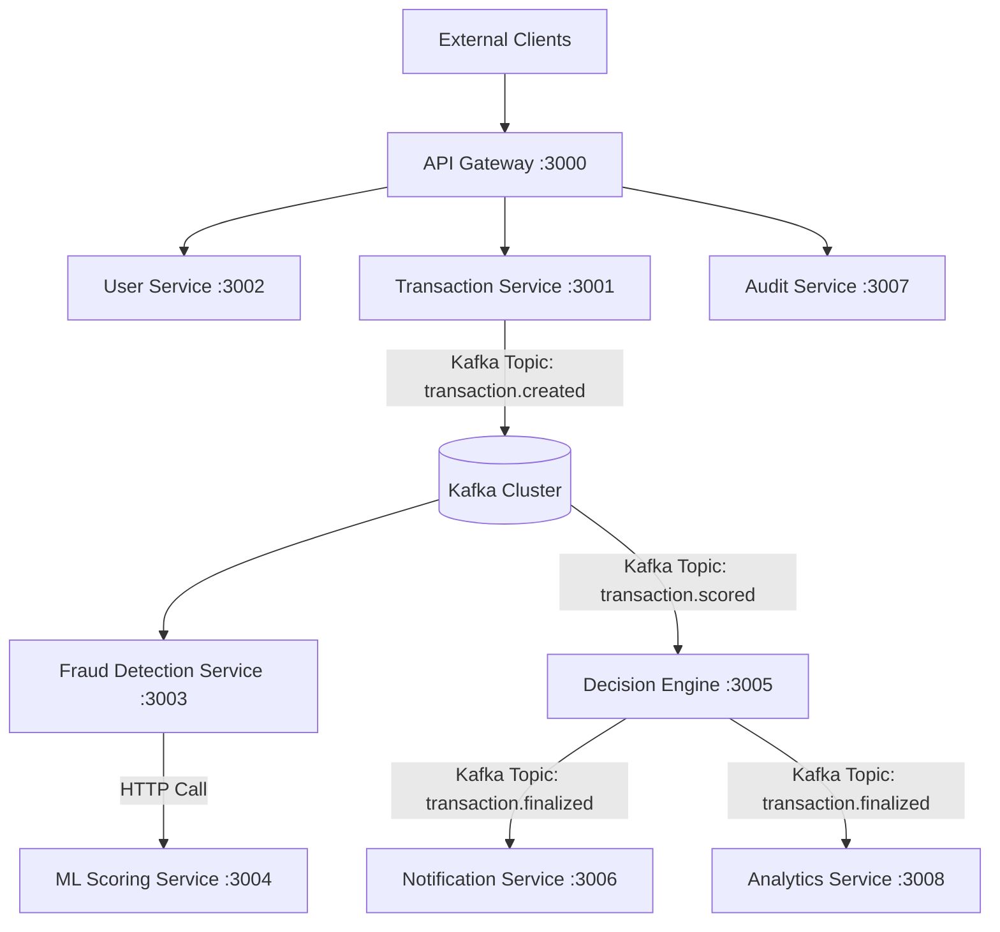

# Fraud Detection Platform

Real-time payment fraud detection system built with Node.js microservices, Kafka, PostgreSQL, and Redis.

---



## Current Services

| Service | Port | Status |
|---|---|---|
| API Gateway | 3000 | Live |
| Transaction Service | 3001 | Live |
| User Service | 3002 | Live |
| Fraud Detection Service | 3003 | Live |
| ML Scoring Service | 3004 | Live |
| Decision Engine | 3005 | Planned |
| Notification Service | 3006 | Planned |
| Audit Service | 3007 | Planned |
| Analytics Service | 3008 | Planned |

---

## Prerequisites

- [Docker Desktop](https://www.docker.com/products/docker-desktop/)
- [Docker Compose](https://docs.docker.com/compose/)

No Node.js installation required - everything runs in containers.

---

## Quick Start

```bash
# Start all services
docker-compose up --build

# Run in background
docker-compose up --build -d
```

Once running, the API is available at `http://localhost:3000`.

---

## Project Structure

```
fraud-detection-system/
├── .gitignore
├── README.md
├── docker-compose.yml
├── Fraud-Detection-Platform.postman_collection.json
│
├── api-gateway/
│   ├── src/
│   │   ├── config/           # App config, logger, Redis client
│   │   ├── middleware/       # JWT auth, rate limiter, error handler, circuit breaker
│   │   ├── routes/           # Health, auth proxy, service proxy
│   │   ├── utils/            # Errors, metrics, constants
│   │   └── index.js
│   ├── .dockerignore
│   ├── Dockerfile
│   └── package.json
│
├── user-service/
│   ├── src/
│   │   ├── config/           # App config, logger, Redis client
│   │   ├── controllers/      # User HTTP handlers
│   │   ├── db/               # PostgreSQL pool, migrations
│   │   ├── middleware/       # Auth, validation, request context, error handler
│   │   ├── repositories/     # User DB operations
│   │   ├── routes/           # User routes, health endpoints
│   │   ├── services/         # Auth logic (bcrypt, JWT generation)
│   │   ├── utils/            # Errors, constants (roles, status)
│   │   └── index.js
│   ├── .dockerignore
│   ├── Dockerfile
│   └── package.json
│
├── transaction-service/
│   ├── src/
│   │   ├── config/           # App config, logger
│   │   ├── controllers/      # Transaction HTTP handlers
│   │   ├── db/               # PostgreSQL pool, migrations
│   │   ├── kafka/            # Producer, outbox publisher
│   │   ├── middleware/       # Request context, validation, error handler
│   │   ├── repositories/     # Transaction DB operations
│   │   ├── routes/           # Transaction routes, health endpoints
│   │   ├── services/         # Transaction business logic
│   │   ├── utils/            # Errors, constants, metrics
│   │   └── index.js
│   ├── .dockerignore
│   ├── Dockerfile
│   └── package.json
│
├── fraud-detection-service/
│   ├── src/
│   │   ├── config/           # App config, logger, Redis client, Kafka
│   │   ├── consumers/        # Kafka transaction consumer
│   │   ├── metrics/          # Prometheus metrics
│   │   ├── middleware/       # Correlation ID, request logger
│   │   ├── routes/           # Health endpoints, metrics scrape
│   │   ├── rules/            # Rule-based fraud engine (velocity, geo, amount, card, time)
│   │   ├── services/         # Fraud detection orchestration, ML scoring client, circuit breaker
│   │   └── index.js
│   ├── .dockerignore
│   ├── Dockerfile
│   └── package.json
│
└── ml-scoring-service/
    ├── src/
    │   ├── config/           # App config, logger, Redis client
    │   ├── controllers/      # Scoring HTTP handlers
    │   ├── middleware/       # Correlation ID, request logger, timeout, validation
    │   ├── models/           # Fraud model (XGBoost-simulated weighted scoring)
    │   ├── routes/           # Health, metrics, scoring endpoints
    │   ├── services/         # Feature engineering, ML scoring orchestration
    │   └── utils/            # Errors, metrics
    ├── .dockerignore
    ├── Dockerfile
    └── package.json
```

---

### Health Checks

No authentication required.

| Endpoint | Description |
|---|---|
| `GET /api/v1/health/live` | Liveness — is the process running? |
| `GET /api/v1/health/ready` | Readiness — are dependencies (Redis) ready? |
| `GET /api/v1/health` | Full health with dependency status |

---

## Testing the API

A Postman collection is provided for testing the system.

1. Start the services:
   ```bash
   docker-compose up --build
   ```
2. Open Postman and import `testing/test.json`
3. Create an environment with `baseUrl = http://localhost:3000`
4. Run requests in order: **Login → Create Transaction → Get Transaction**

For full testing documentation, see `testing/TESTING.md`.

---

## Architecture

```
Client
  │
  ▼
API Gateway :3000
  │  JWT validation · Rate limiting · Request routing
  │
  ├──▶ User Service :3002
  │     Registration · Login · Profile · JWT generation
  │     ├─▶ PostgreSQL (user-db)
  │     │    Users, login attempts, refresh tokens
  │     └─▶ Redis (db:2)
  │          Rate limiting, session blacklist
  │
  └──▶ Transaction Service :3001
        Validation · Idempotency · Card masking
        ├─▶ PostgreSQL (transaction-db)
        │    Atomic: transaction + outbox event
        └─▶ Kafka (transaction.created)
             │
             ▼
        Fraud Detection Service :3003
          Rule engine · ML scoring · Risk combination
          ├─▶ Redis (db:3)
          │    Velocity tracking (hourly/daily counts + amounts)
          ├─▶ ML Scoring Service :3004
          │    HTTP · Circuit breaker · Graceful fallback · Redis cache
          └─▶ Kafka (transaction.scored)
               → Decision Engine (planned)

Shared Infrastructure:
  • Redis :6379 (db:0 = gateway rate limits, db:2 = user sessions, db:3 = fraud velocity)
  • Kafka + Zookeeper (7 topics pre-created)
```

### Fraud Detection Pipeline

Each transaction consumed from `transaction.created` is processed as follows:

1. **Rule engine** — runs five checks in parallel: velocity (hourly/daily count + spend), geography (high-risk countries), amount thresholds, card BIN blacklist, and unusual transaction time. Each rule contributes a weighted score (0–100).
2. **ML scoring** — HTTP call to the ML Scoring Service (`:3004`), protected by a circuit breaker with a graceful rule-derived fallback. The ML service runs feature engineering (35+ features across amount, velocity, geography, temporal, and card dimensions) and a calibrated gradient-boosted model to return a fraud probability score (0–100) with per-feature explainability. Results are cached in Redis (db:4) with a configurable TTL.
3. **Score combination** — weighted blend of rule score (40%) and ML score (60%). Transaction is flagged if rules hard-trigger or ML score exceeds threshold (default: 70).
4. **Result published** to `transaction.scored` for the Decision Engine.

---

## Infrastructure

All infrastructure is managed by Docker Compose:

| Container | Image | Purpose |
|---|---|---|
| zookeeper | confluentinc/cp-zookeeper:7.5.0 | Kafka coordination |
| kafka | confluentinc/cp-kafka:7.5.0 | Event streaming |
| kafka-init | confluentinc/cp-kafka:7.5.0 | Topic creation on startup |
| redis | redis:7-alpine | Rate limiting, caching, velocity tracking |
| user-db | postgres:15-alpine | User authentication & profile storage |
| transaction-db | postgres:15-alpine | Transaction storage |

### Kafka Topics

| Topic | Partitions | Purpose |
|---|---|---|
| transaction.created | 6 | New transactions entering the pipeline |
| transaction.scored | 6 | Fraud risk scores from fraud detection service |
| transaction.finalised | 6 | Approved / declined decisions |
| transaction.flagged | 6 | Flagged for manual review |
| transaction.reviewed | 3 | Human review outcomes |
| transaction.reversed | 3 | Chargebacks and reversals |
| transaction.dlq | 3 | Dead letter queue |

---

## Rate Limits

| Endpoint type | Limit |
|---|---|
| Transaction endpoints | 50 requests / minute / user |
| Standard endpoints | 100 requests / minute / user |
| Auth endpoints | 5 attempts / 15 minutes / IP |

---

## Stopping the System

```bash
# Stop containers (preserves data volumes)
docker-compose down

# Stop and remove all data (full reset)
docker-compose down -v
```