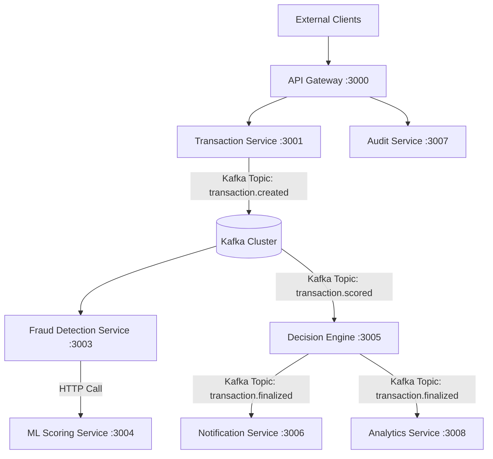

# Fraud Detection Platform

Real-time payment fraud detection system built with Node.js microservices, Kafka, PostgreSQL, and Redis.

---



## Current Services

| Service | Port | Status |
|---|---|---|
| API Gateway | 3000 | Live |
| Transaction Service | 3001 | Live |
| Fraud Detection Service | 3003 | Planned |
| ML Scoring Service | 3004 | Planned |
| Decision Engine | 3005 | Planned |
| Notification Service | 3006 | Planned |
| Audit Service | 3007 | Planned |
| Analytics Service | 3008 | Planned |

---

## Prerequisites

- [Docker Desktop](https://www.docker.com/products/docker-desktop/)
- [Docker Compose](https://docs.docker.com/compose/)

No Node.js installation required — everything runs in containers.

---

## Quick Start

```bash
# Start all services
docker-compose up --build

# Run in background
docker-compose up --build -d
```

Once running, the API is available at `http://localhost:3000`.
---

## Project Structure

```
fraud-detection-system/
├── docker-compose.yml
├── api-gateway/
│   ├── src/
│   │   ├── config/         # App config, Redis, logger, route map
│   │   ├── middleware/      # JWT auth, rate limiter, error handler
│   │   ├── routes/          # Health, auth, proxy router
│   │   ├── services/        # Auth service, proxy service
│   │   └── utils/           # Errors, metrics, constants
│   ├── Dockerfile
│   └── package.json
└── transaction-service/
    ├── src/
    │   ├── config/          # App config, logger
    │   ├── controllers/     # Transaction controller
    │   ├── db/              # PostgreSQL pool, migrations
    │   ├── kafka/           # Producer, outbox publisher
    │   ├── middleware/      # Request context, validation, error handler
    │   ├── repositories/    # Transaction repository
    │   ├── routes/          # Transaction routes, health
    │   ├── services/        # Transaction service (core business logic)
    │   └── utils/           # Errors, constants, metrics
    ├── Dockerfile
    └── package.json
```

---

## API Reference

### Authentication

All protected endpoints require a Bearer token in the `Authorization` header.

#### Login
```
POST /api/v1/auth/login
```
```json
{
  "email": "admin@example.com",
  "password": "admin123"
}
```

**Test credentials:**
| Email | Password | Role |
|---|---|---|
| admin@example.com | admin123 | admin |
| user@example.com | user123 | user |

**Response:**
```json
{
  "success": true,
  "data": {
    "token": "<jwt>",
    "user": { "userId": "...", "email": "...", "role": "admin" }
  }
}
```

---

### Transactions

All transaction endpoints require `Authorization: Bearer <token>`.

#### Create Transaction
```
POST /api/v1/transactions
```

**Headers:**
| Header | Required | Description |
|---|---|---|
| Authorization | ✓ | Bearer JWT token |
| Content-Type | ✓ | application/json |
| X-Idempotency-Key | Recommended | Unique key to prevent duplicate submissions |
| X-Correlation-ID | Optional | For distributed tracing |

**Body:**
```json
{
  "customerId": "customer_123",
  "merchantId": "merchant_456",
  "amount": 1500.00,
  "currency": "USD",
  "cardNumber": "4111111111111111",
  "cardType": "visa",
  "deviceId": "device_abc",
  "ipAddress": "192.168.1.100",
  "location": {
    "country": "SG",
    "city": "Singapore"
  },
  "metadata": {
    "channel": "mobile"
  }
}
```

**Response `201`:**
```json
{
  "success": true,
  "idempotent": false,
  "data": {
    "transactionId": "9f83e9a1-2ed3-4a0e-a438-8817eb266899",
    "status": "PENDING",
    "amount": 1500,
    "currency": "USD",
    "customerId": "customer_123",
    "merchantId": "merchant_456",
    "cardLastFour": "1111",
    "createdAt": "2026-02-17T14:57:10.845Z",
    "correlationId": "test-corr-001",
    "message": "Transaction received and queued for fraud analysis"
  }
}
```

> **Note:** Card numbers are never stored — only the last 4 digits are persisted.

#### Get Transaction by ID
```
GET /api/v1/transactions/:id
```

#### Get Transactions by Customer
```
GET /api/v1/transactions/customer/:customerId
```

---

### Health Checks

No authentication required.

| Endpoint | Description |
|---|---|
| `GET /api/v1/health/live` | Liveness - is the process running? |
| `GET /api/v1/health/ready` | Readiness - are dependencies (Redis) ready? |
| `GET /api/v1/health` | Full health with dependency status |

---

## Example curl Commands

### 1. Get a token
```bash
curl -X POST http://localhost:3000/api/v1/auth/login ^
-H "Content-Type: application/json" ^
-d "{\"email\":\"admin@example.com\",\"password\":\"admin123\"}"
```

### 2. Submit a transaction
```bash
curl -X POST http://localhost:3000/api/v1/transactions ^
-H "Authorization: Bearer <your-token>" ^
-H "Content-Type: application/json" ^
-H "X-Idempotency-Key: unique-key-001" ^
-d "{\"customerId\":\"customer_123\",\"merchantId\":\"merchant_456\",\"amount\":1500.00,\"currency\":\"USD\",\"cardNumber\":\"4111111111111111\",\"cardType\":\"visa\",\"deviceId\":\"device_abc\",\"ipAddress\":\"192.168.1.100\",\"location\":{\"country\":\"SG\",\"city\":\"Singapore\"},\"metadata\":{\"channel\":\"mobile\"}}"
```

### 3. Fetch a transaction
```bash
curl -X GET http://localhost:3000/api/v1/transactions/<transactionId> ^
-H "Authorization: Bearer <your-token>"
```

---

## Architecture

```
Client
  │
  ▼
API Gateway :3000
  │  JWT auth · Rate limiting · Request routing
  │
  ▼
Transaction Service :3001
  │  Validation · Idempotency · Card masking
  │
  ├──▶ PostgreSQL (transaction-db)
  │     Stores transaction + outbox event atomically
  │
  └──▶ Kafka (transaction.created)
        Consumed by fraud detection pipeline (coming soon)
```

---

## Infrastructure

All infrastructure is managed by Docker Compose:

| Container | Image | Purpose |
|---|---|---|
| zookeeper | confluentinc/cp-zookeeper:7.5.0 | Kafka coordination |
| kafka | confluentinc/cp-kafka:7.5.0 | Event streaming |
| kafka-init | confluentinc/cp-kafka:7.5.0 | Topic creation on startup |
| redis | redis:7-alpine | Rate limiting, caching |
| transaction-db | postgres:15-alpine | Transaction storage |

### Kafka Topics
| Topic | Partitions | Purpose |
|---|---|---|
| transaction.created | 6 | New transactions entering the pipeline |
| transaction.scored | 6 | ML risk scores |
| transaction.finalised | 6 | Approved / declined decisions |
| transaction.flagged | 6 | Flagged for manual review |
| transaction.reviewed | 3 | Human review outcomes |
| transaction.reversed | 3 | Chargebacks and reversals |
| transaction.dlq | 3 | Dead letter queue |

---

## Rate Limits

| Endpoint type | Limit |
|---|---|
| Transaction endpoints | 50 requests / minute / user |
| Standard endpoints | 100 requests / minute / user |
| Auth endpoints | 5 attempts / 15 minutes / IP |

---

## Stopping the System

```bash
# Stop containers (preserves data volumes)
docker-compose down

# Stop and remove all data (full reset)
docker-compose down -v
```