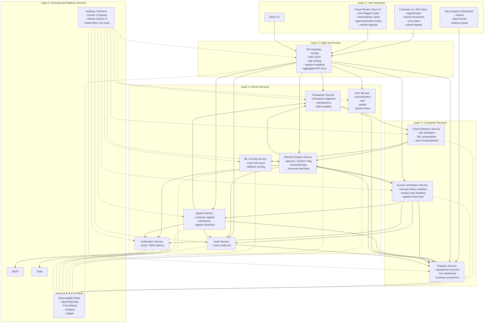

# Fraud Detection Platform: SOA Layers, Atomic Services, and Composite Services

## Purpose

This document describes the project using a Service-Oriented Architecture view rather than a deployment or demo view.

The focus here is:

- the SOA layers in the platform
- the distinction between composite services and atomic services
- the business function of each service
- the service ownership rule that each atomic service should own one primary business capability and one primary persistence boundary

## SOA Layering Model

The project can be understood in five layers.

### Layer 1: User Interfaces

This layer contains the entry points used by customers, fraud reviewers, and operators.

- Customer UI / API Client
- Fraud Review Team UI
- Ops Analytics Dashboard
- Demo UI

### Layer 2: Edge and Access

This layer provides controlled entry into the platform.

- API Gateway

Main role:

- expose a single entry point
- route requests to internal services
- apply cross-cutting access concerns such as authentication checks, request metadata, and rate limiting

### Layer 3: Composite Services

This layer coordinates multi-step workflows across lower-level business services.

- Fraud Detection Service
- Human Verification Service
- Analytics Service

Main role:

- orchestrate multiple business operations
- combine multiple service outcomes into a workflow
- provide process-level behavior rather than a single isolated business record

### Layer 4: Atomic Services

This layer contains the core business services that each represent a focused capability.

- User Service
- Transaction Service
- ML Scoring Service
- Decision Engine Service
- Appeal Service
- Notification Service
- Audit Service

Main role:

- own a focused business capability
- expose clear service boundaries
- own one primary persistence boundary or primary source of truth for their capability

### Layer 5: External and Platform Services

This layer contains non-domain supporting systems.

- SMTP
- Twilio
- Observability stack
- Docker Compose / CI / Kubernetes runtime support

These support the platform but are not part of the core business domain itself.

## SOA Diagram

## Atomic Service Rule

For this project, the atomic service rule is:

- one atomic service should own one focused business capability
- one atomic service should own one primary persistence boundary or one primary source of truth
- other services should not directly write into that service's owned data

This is the main idea behind "database per service" in SOA and microservices.

That does not mean the entire platform has only one database. It means each atomic service should have its own bounded ownership.

Examples in this project:

- User Service owns identity and profile data
- Transaction Service owns transaction lifecycle state
- Decision Engine Service owns decision records and decision history
- Appeal Service owns appeal records
- Audit Service owns audit records

For services that do not behave like record-owning transactional services:

- ML Scoring Service is computation-focused rather than record-focused
- Notification Service is delivery-focused rather than record-focused

So the important rule is not literally "every service must have a database", but rather:

- every atomic business capability should have a clear owner
- if persistence exists, that persistence should be owned by that service alone

## Composite Service Rule

Composite services should:

- coordinate workflows across multiple services
- depend on lower-level business services
- avoid becoming the long-term owner of multiple unrelated core business entities

In this project, composite services are used to express workflow and process logic.

## Atomic Services in This Project

### User Service

Business function:

- registration
- login
- JWT issuance and refresh
- profile retrieval and update

Why atomic:

- it owns a single identity and access capability
- other services rely on it but do not replace it

Primary ownership:

- user identity and profile records
- refresh-token lifecycle

### Transaction Service

Business function:

- accept transaction submissions
- enforce idempotency
- maintain transaction state through the fraud lifecycle

Why atomic:

- it is the system of record for transaction state
- it owns the transaction lifecycle boundary

Primary ownership:

- transaction records
- idempotency records
- outbox records tied to transaction publication

### ML Scoring Service

Business function:

- generate fraud risk scores
- return model metadata and fallback scoring output

Why atomic:

- it performs one specialized scoring function
- it does not own the broader fraud workflow

Primary ownership:

- scoring logic and model-serving behavior

### Decision Engine Service

Business function:

- convert fraud analysis into approve, decline, or flag decisions
- apply thresholds and override rules

Why atomic:

- it owns the decision policy boundary
- it is responsible for final automated decision determination

Primary ownership:

- decision records
- decision history

### Appeal Service

Business function:

- create customer appeals
- resolve appeals

Why atomic:

- it owns one dispute-specific capability
- it does not own the original fraud detection process itself

Primary ownership:

- appeal records
- appeal resolution state

### Notification Service

Business function:

- send emails and SMS messages

Why atomic:

- it owns one outbound communication capability
- it is reusable across multiple business events

Primary ownership:

- notification delivery behavior and provider integration

### Audit Service

Business function:

- store audit trail events

Why atomic:

- it owns one compliance-oriented logging capability
- it centralizes traceable event history

Primary ownership:

- audit records

## Composite Services in This Project

### Fraud Detection Service

Composite function:

- consumes transaction input
- applies fraud rules
- calls ML Scoring Service
- packages fraud analysis for downstream decisioning

Why composite:

- it combines rules logic, ML scoring, and pipeline behavior
- it coordinates more than one lower-level concern
- it sits above transaction creation and below final decisioning

### Human Verification Service

Composite function:

- receives flagged cases
- manages analyst review workflow
- supports claim, release, and manual decision actions
- supports appeal review operations

Why composite:

- it coordinates a human-in-the-loop business process
- it connects flagged transactions, analyst actions, decision updates, and appeal resolution

### Analytics Service

Composite function:

- collects business outcomes from across the platform
- builds overview and operational views
- exposes dashboard-oriented read models

Why composite:

- it combines results from transactions, decisions, reviews, appeals, and audit activity
- it is not the system of record for those core business entities

## Layer-to-Service Mapping Summary

| Layer | Services |
| --- | --- |
| User Interfaces | Customer UI / API Client, Fraud Review UI, Ops Dashboard, Demo UI |
| Edge and Access | API Gateway |
| Composite Services | Fraud Detection Service, Human Verification Service, Analytics Service |
| Atomic Services | User Service, Transaction Service, ML Scoring Service, Decision Engine Service, Appeal Service, Notification Service, Audit Service |
| External and Platform Services | SMTP, Twilio, Observability stack, Docker Compose, GitHub Actions CI, Kubernetes core track |

## Architectural Notes

### Why the Gateway is not an atomic business service

The API Gateway is part of the access layer, not a domain capability service.

Its role is:

- entry-point control
- routing
- cross-cutting policy enforcement

It should not own business data or core domain logic.

### Why Analytics is composite, not atomic

Analytics depends on outputs from several other services.

It is therefore better framed as a composite or projection-oriented service rather than a single atomic business capability.

### Why Human Verification is composite, not atomic

Human verification is a workflow service, not just a single CRUD entity.

It coordinates:

- flagged transactions
- analyst case management
- manual decisions
- appeal-related reviewer actions

That makes it composite in the SOA sense.

## Design Rule for This Project

The cleanest SOA reading of this project is:

- atomic services own focused capabilities and their primary data boundary
- composite services orchestrate workflows across atomic services
- the gateway exposes access but does not own business logic
- analytics and audit remain outside the critical transaction decision path

## Final Classification

This project is best described as:

- a layered SOA system
- with a microservice-style implementation
- where atomic services own focused business capabilities
- and composite services implement fraud workflow, human review workflow, and overview/projection workflow
